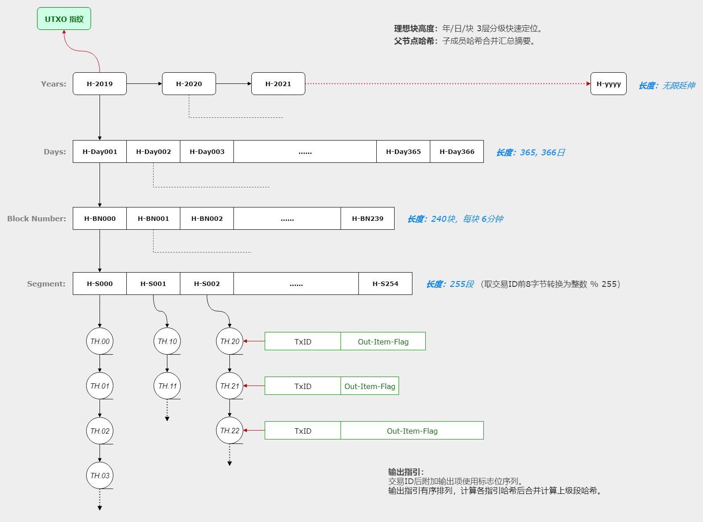

# 区块查询微服务（blockqs）

## 前言

将区块数据单独存储并提供必要的查询服务，可以对区块链系统中庞大存储负载进行分离。

借助于UTXO指纹的设计，当前区块所需的UTXO集合可以轻易验证。因为存在公共的区块查询服务，全节点不再必需，普通的节点就可以完成所需的验证工作。另外，区块数据托付于单独的服务网络，也使得数据的缓存和共享更有效率。

> **注：**<br>
> 如果交易规模较大，可以采用组队校验的分片工作模型。详见「附1：组队校验」。<br>

因为验证节点会存储近期的区块以及UTXO集内的交易数据，查询服务并不会有想象中的那样繁忙，它们可能更多地服务于对漫长历史区块的检索。


## 理想块

按交易时间戳计算的应当及时收录该笔交易的区块，称为交易的理想块。如果按6分钟的固定出块时间计算：
```go
理想块高度 = （交易时间戳 - 创始块时间戳） / 6分钟 + 1
```

一笔交易如果按简单的交易ID直接定位，可能并不是一个高效的做法。本设计中交易是按理想块高度和交易ID进行分级定位，交易输入项中的3个字段是：理想块高度（4字节）、交易ID（32字节）、输出项下标（2字节）。

> **注：**<br>
> 系统不支持未确认交易作为输入源。这可以简化逻辑，同时也有利于组队校验的纵向分片设计。<br>

理想块高度只与交易的时间戳有关，因此并不受交易实际收录的区块高度以及分叉的影响。


## 区块存储

一个区块并不一定要作为一个单独的文件存储。为便于交易数据的检索，存储实际上是以交易为单位进行设计。因为交易采用理想块高度定位，结合设计中UTXO指纹的要求，我们设计了一个四层分级的树容器，用来收纳和管理交易。

1. **年**：理想块所在的年份。这是一个无限延伸的顶级分组。
2. **日**：理想块所在的日次。一个完整年度包含365或366天，长度确定。
3. **块**：理想块在当日的块序号。一天240个区块（编号0-239），长度固定。
4. **段**：将交易分成255组（0-254）。组号由交易ID前8字节转为整数后对255取模运算。长度固定。

末端的段分级收纳实际的交易数据。以交易为单位的存储可以让文件尽量小，这能获得一些存储和操作上的灵活性，也可能更易于适应不同的存储介质。实际的区块文件只是一个交易清单，指明哪些交易已被收录和存储。存储结构如下示意：

```go
_data/                              // 存储根
    2019/                           // 年度
        001/                        // 日次：第1天
        ...
        365/                        // 日次：按实际的历法计算
            000/                    // 块号：当日第1块，从0开始编号
            ...
            239/                    // 块号：当日最后一块，按6分钟出块计算
                000/                // 段组：第1组，从0开始编号
                ...
                254/                // 段组：最后一组。值255有其它用途
                    [TxID].data     // 交易数据
                    [TxID].sig      // 签名数据
                    [TxID].index    // 交易数据&签名的索引
                    chksum.list     // 当前目录内各文件的校验和清单
                    ...
                                    // 块级：
            [height].block          // 实际区块的交易清单，决定了树容器中的内容
            [height].chksum         // 上面交易清单文件的校验和
```

> **注：**<br>
> 年/日分级遵循实际的历法时间以获得一种用户友好性。<br>
> 各分级可以通过交易时间戳（或理想块高度+创始块时间戳）、出块时间间隔以及交易ID简单地计算得到。<br>


## UTXO指纹

UTXO是区块链所有未花费输出的集合，为了对当前UTXO集可以进行验证，我们添加了UTXO指纹设计。


### UTXO指纹结构图



这是一个与上面区块存储保持同样结构的四层分级树容器，末端的段分级内存储交易的输出指引（交易ID+输出花费标记）。输出指引有序排列，合并计算所属段的哈希值，逐级向上汇总计算到根哈希，该根哈希即为UTXO指纹。算法示意如下：

```go
TXOF:           Hash(TxID + OutFlag)    // 输出指引：花费状态标记
Segment:        Hash(TXOF, ...)         // 段：成员数量不定
Block:          Hash(Segment, ...)      // 块：255段
Day:            Hash(Block, ...)        // 日：240块
Year:           Hash(Day, ...)          // 年：365或366日
RootChksum:     Hash(Year, ...)         // UTXO指纹：年度无限增长，可接受
```

这其实是一个宽成员的哈希校验树，四层分级可减少每次输出指引改变带来的重新计算的数据量。每个哈希值32字节，年度哈希值的无限增长可接受。


### 意义

UTXO指纹会对区块链末端产生合法性约束，实际上，它有些像全链交易历史的当前总结。正因如此，一个刚刚上线的节点可以请求并不太多的数据量（区块头链、末端11个区块、以及当前UTXO集合），就可以大致确定目标主链是否合法，然后再同步客户端硬绑定高度之后的区块进行完整校验。

这可以极大地降低新节点进入的门槛，提升区块链系统的整体效率。
