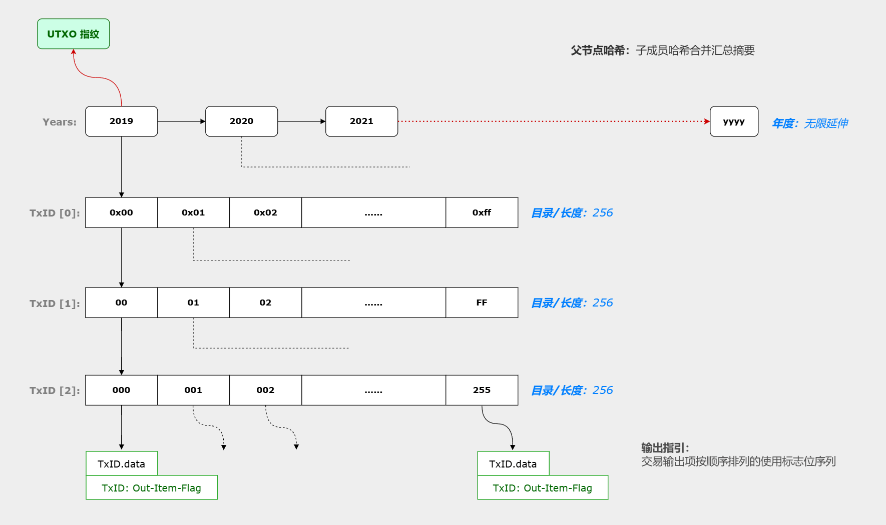

# 区块查询微服务（blockqs）

## 前言

将区块数据单独存储并提供必要的查询服务，可以对区块链系统中庞大存储负载进行分离。

借助于UTXO指纹的设计，当前区块所需的UTXO集合可以轻易验证。因为存在公共的区块查询服务，全节点不再必需，普通的节点就可以完成所需的验证工作。另外，区块数据托付于单独的服务网络，也使得数据的缓存和共享更有效率。

> **注：**
> 如果交易规模较大，可以采用组队校验的分片工作模型。详见「附1：组队校验」。

因为验证节点会存储近期的区块以及UTXO集内的交易数据，查询服务并不会有想象中的那样繁忙，它们可能更多地服务于对漫长历史区块的检索。


## 区块存储

区块数据的存储按尽量分离的原则进行，即以交易数据为单元进行小文件存储。检索交易的路径结构分两个面向：简易的 `442检索`，以及基础性的输入项 `2+20+2` 来源检索。

- `4+4+2` 结构：区块高度4字节、交易在区块中的序位4字节、输出项在交易输出集中的偏移2字节。由 `GOTO/JUMP` 两个指令使用。
- `2+20+2` 结构：交易时间戳年度2字节、交易ID片段20字节、输出项偏移2字节（同上）。由交易的输入项使用。

```go
// 2+20+2 检索
// TxID 使用查询键的20字节序列
2025/                           // 年度（交易）
    [TxID:0xff]/                // 一级：1字节16进制表达，前置 0x 以与日次区分
        [TxID:FF]/              // 二级：同上，但大写且无前置 0x
            [TxID:000]/         // 三级：同上1字节，但用10进制表达
                [TxID].data     // 交易数据
                [TxID].sig      // 签名数据
                [TxID].index    // 交易数据&签名的索引
                [TxID].meta     // 交易的元信息，包含交易所在区块、时间戳、哈希摘要等
                chksum.list     // 当前目录内各文件的校验和清单

// 442 检索
2025/                           // 年度（区块）
    001/                        // 日次：第1天
    365/                        // 日次：按实际历法计算（365|366）
        [height].block          // 区块内交易的清单：按交易在区块中的顺序排列
        [height].timestamp      // 交易的时间戳：与.block内容对应
        [height].chksum         // 两个清单文件的校验和
```

下段的*年/日*分级用于 `GOTO/JUMP` 指令定位交易：由区块高度计算出年度和日次 => 由交易序位检索交易ID和交易时间戳 => 由 `2+20+2` 结构检索交易数据。

假设一个区块最多包含64k笔交易，`2+20+2` 结构下的三级分层里，末端目录平均会容纳343笔交易的数据，如果一笔交易4个文件，一个目录大概容纳1400个文件不到。这在普通终端上是可行的。

> **注：**
> 源于固定的出块时间，区块的时间戳可以仅通过*创始块时间*和*区块高度*计算出来。


## UTXO指纹

UTXO是区块链所有未花费输出的集合，为了对当前UTXO集可以进行验证，我们添加了UTXO指纹设计。


### UTXO指纹结构图



这是一个与上面区块存储保持同样结构的四层分级（`2+20+2`）树容器，末端的交易数据文件中存储着交易的输出指引（未花费标记）。

末端目录内所有的输出指引合并计算哈希值，上级汇总计算当前目录内子哈希的哈希值，逐级向上得到根哈希，即为UTXO指纹。

这其实是一个宽成员的哈希校验树，总共四层的分级可减少每次输出指引改变带来的重新计算的数据量。顶层为年度，虽然是一个无限增长的序列，但粒度足够大，可接受。


### 意义

UTXO指纹会对区块链末端产生合法性约束，实际上，它有些像全链交易历史的当前总结。正因如此，一个刚刚上线的节点可以请求并不太多的数据量（区块头链、末端11个区块、以及当前UTXO集合），就可以大致确定目标主链是否合法，然后再同步客户端硬绑定高度之后的区块进行完整校验。

这可以极大地降低新节点进入的门槛，提升区块链系统的整体效率。


### 附：UTXO指纹的循环递进约束

#### 当前区块与当前UTXO集合

> 当前区块是指当前正在验证交易数据，即将创建的区块。当前UTXO集合是当前区块所依据的UTXO集合，它尚未减去当前区块所收录交易的花费。<br>
> 当前UTXO集去除掉当前区块收录交易的花费，加上新的输出和Coinbase铸币，就成为当前区块的UTXO结果集。<br>

当前区块的UTXO指纹从当前UTXO集合计算而来，计算的是上一区块完成后的UTXO结果集。这样的设计可以为UTXO指纹计算留出足够的时间，而附带地也获得了一种循环递进的约束，使得可以从当前UTXO集循环递进逆向推导和验证整条区块链。


#### 推导流程示例

- 假设当前区块为101号，当前UTXO集即为第100号区块的UTXO结果集。
- 当前UTXO集减去第100号区块的新输出和Coinbase铸币、加上第100号区块的输入花费，可得到第100号区块的当前UTXO集。
- 计算这个集合的指纹，它应当与第100号区块记录的UTXO指纹相同。这样就验证了（101号区块的）当前UTXO集合的合法性。
- 如果再用第100号区块的当前UTXO集减去第99号区块的新输出和Coinbase铸币，以及同样的输入处理，就可以验证第100号区块的当前UTXO集。
- 如此循环递进，我们就可以从一个最新的UTXO集合逆向验证区块链至任意历史位置。

另外，UTXO指纹表达的是上一区块的UTXO结果集，这使得指纹的约束是链式的，攻击者无法通过单个区块的交易ID塑造来匹配UTXO指纹。
