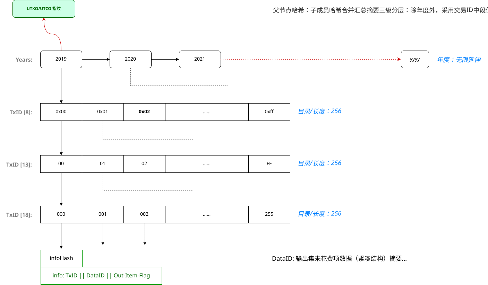

# 区块查询服务（BlockQs）

## 前言

区块链是去中心化的，构成去中心化网络的节点应当是大众化的。

作为一个持续长久运行的区块链系统，区块数据持续增长。理论上，所有的区块数据都应当完整无缺，这对一个大众化的普通节点来说通常很难承受。

如果可以将区块数据从区块链中剥离出来，由一个公共的存储服务网络负责，让大众化的节点也可以轻松运行校验，会很有意义。

> **注：**
> UTXO/UTCO指纹设计可以让普通节点轻松完成当前UTXO/UTCO集合的校验。


## 数据流

区块查询服务针对某个具体的区块链，服务器存储完整的区块数据，提供高效的检索服务。

检索主要针对交易数据和完整区块信息，交易中的附件由 `Depots` 网络提供。参考项目：[github.com/cxio/depots](https://github.com/cxio/depots)

一台服务器也可以同时支持对多个区块链的服务，这由服务器的硬件性能和配置决定（用户自由）。

> **注：**
> 系统通常会提供小附件（`<10MB`）的直接获取。


### 服务探测

区块链节点通过「基网」向全网查询支持本区块链的服务节点，创建连接然后请求服务。

> **注：**
> 在基网中查询服务节点参考项目：[github.com/cxio/p2p](https://github.com/cxio/p2p)。


### 数据服务

建立连接后，服务器即可向节点提供交易数据的查询。

单笔交易的数据通常较小，这是由区块链本身的特性决定的。但一个完整区块的数据量可能有上百兆，因此可能需要花费较长的时间，通常由另外的同步进程处理。

对交易信息的查询，是实时 Web 服务（RESTful）。


## 存储策略

### 交易数据

区块链的核心是交易，因此这里以交易为基本单元进行存储。

基本存储实现采用本地文件系统存储，目录结构参考 UTXO 集的「年度+3层分组」结构。末端为以全ID命名的数据目录。

```go
2026/                               // 交易年度（按交易时间戳计算）
    TxID[8]/                        // 目录名：1_FF（层级_十六进制大写）
        TxID[13]/                   // 目录名：2_FF
            TxID[18]/               // 目录名：3_FF
                TxID[0:20]/         // 数据目录，交易ID前20字节序列，十六进制小写，共40字符
                    tx.data         // 交易数据，文件名取交易ID局部16字节序列16进制串，小写。下同
                    tx.sig          // 签名数据（后期可以删除）
                    tx.meta         // 交易元信息，包含交易的完整ID、时间戳、所在区块及ID序位等基本信息
                    tx.tree         // 交易数据校验树，便于单项输出验证
                    chksum.list     // 各文件校验和，只读
```

> #### 关于年度
> 顶层设计年度分级，主要是为了方便管理。区块有固定的时间间隔，因此很容易计算得出。


### 基础数据

作为每个上线节点都需要的基础数据，区块头链和UTXO/UTCO集单独存储。

**区块头**结构包含大约112字节数据，全年87661个区块，合计：112x87661 ~= **9.36**MB。

UTXO/UTCO 集合是一个多层树结构，顶层以年度分组。可以将之序列化存储到本地，也可以构建在内存中，供应用节点检索获取。

```go
// 区块头链，存放在年度根目录下
2026/
    blocks.head         // 年度区块头数据，约 9.36MB
    blocks.chksum       // 区块头校验码
```

```go
// UTXO/UTCO 本地映射
2026/                               // 交易年度
    TxID[8]/                        // 一级分层
        TxID[13]/                   // 二级分层
            TxID[18]/               // 三级分层
                TxID[0:20]/         // 未花费/转出数据目录
                    utxo.data       // UTXO 数据包
                    utco.data       // UTCO 数据包
                    meta.info       // 必要的基本信息：完整TxID、时间戳……
                    chksum.list     // 各文件校验和
```


#### 附：UTXO/UTCO 示意图




### 区块索引

主要用于节点同步完整区块数据，以及客户端申请对交易进行验证。

```go
2026/                       // 区块年度
    001/                    // 日次
        [height].txlist     // 区块交易ID清单，与交易在区块中的实际顺序排列（含前置序号）
        [height].tree       // 哈希校验树缓存，可由上面的 .txlist 计算而来
        [height].sqlite     // 交易ID[:20] => 接收者地址 映射表
        chksum.list         // 各文件校验和，只读
    365/                    // 年末日
    366/                    // 闰年末日
```


#### 附：账户关联交易查询

此索引也可以支持用户对自身账户关联的交易的查询。这会有隐私性的考虑，通常采用如下方式进行：

- 根据概略的年度，下载特定区块的 `.sqlite` 文件，从中发掘自己账户关联的交易ID。
- 然后通过尽可能短的*交易ID组*检索需要的交易数据。

作为一种优化支持，服务器可以提供简约版构造，SQLite: `TxID[:8] => Address[:n]`，用更短的ID片段映射定制的地址长度。

这是一种借助于*模糊性*的隐私保护策略。


### 附件档案

交易中的附件仅表示为一个ID（附件数据的相关信息），附件本身存储于区块链之外。这是为了区块链主体系统的轻量和高效。

附件的大小没有限制，但在交易中有所体现：存在于附件ID的末尾。

附件是一种存档逻辑，由P2P文件分享的方式上传到数据驿站网络。详见 `Depots` 项目。


## 数据检索

Blockqs服务器不只是向交易校验组节点提供数据，还需要向普通用户节点提供服务。

下面是需要提供的检索条目：

| 检索目标 | 查询参数 | 说明 |
|----------|---------|-------|
| 输出项 | 年度 + 交易ID + 输出序位 | 通用的交易输出项&脚本检索 |
| 输出项集 | 年度 + 交易ID | 目标交易的全部输出项 |
| 输出项证明 | 年度 + 交易ID + 输出序位 | 不含输出项数据，仅输出项的证明路径 |
| 交易 | 年度 + 交易ID | 完整的交易数据 |
| 交易元信息 | 年度 + 交易ID | 所在区块高度、序位，交易时间戳等 |
| 交易证明 | 年度 + 交易ID | 交易到区块交易树根的验证路径 |
| 区块 | 区块号 | 完整的区块数据 |
| 区块概要 | 区块号 | 区块包含的完整交易ID序列 |
| 区块证明 | 区块号 | 区块的证明包（详见下文） |
| 区块链证明 | 创世块ID | 链末端至少31个区块的证明包 |
| 区块头链 | 创世块ID | 主要用于初始上线节点下载此基准数据 |
| UTXO 项 | 年度 + 交易ID | UTXO指纹证明路径和交易输出项状态位集 |
| UTCO 项 | 年度 + 交易ID | UTCO指纹证明路径和交易输出项状态位集 |
| UTXO 集 | 创始块ID | 获取当前最新 UTXO 集 |
| UTCO 集 | 创始块ID | 获取当前最新 UTCO 集 |
| UTXO 指纹 | 区块高度 | 目标区块的 UTXO 指纹 |
| UTCO 指纹 | 区块高度 | 目标区块的 UTCO 指纹 |
| 交易ID组 | 年度 + 区块号 + 交易ID片段 | 用交易ID的前段局部模糊匹配其它交易ID（成组），仅返回完整交易ID组 |
| 附件ID | 年度 + 交易ID + 输出序位 | 目标脚本关联的附件信息 |
| 小附件 | 年度 + 交易ID + 输出序位 | 目标脚本关联的附件，仅限于 `<10MB` 的小附件 |
| 附件索引 | 年度 + 交易ID + 输出序位 | 目标脚本关联的大附件的分片索引 |

> **注：**<br>
> Blockqs服务器与区块链节点连接，可以实时接收其广播的交易并暂存。<br>
> 证明性材料同时可提供二进制规范包数据（便于验证）。<br>
> 输出项证明主要用于解耦数据和证明（数据可能从UTXO/UTCO缓存集获取，但其无证明能力）。<br>

如果知道一笔交易的ID及其时间戳，可以计算出所在年度，然后查询交易数据（含 meta 信息）。


### 区块证明包

即可验证区块是否合法的最小证明数据。它也是新区块创建后，最初向全网广播的数据包。

1. `BlockHeader`区块头。
2. `CoinbaseTx`铸币交易。
3. `CoinbaseTxIndex`铸币交易位置（固定为0）。
4. `CoinbaseMerklePath`铸币交易的默克尔验证路径。
5. `TreeRoot`区块交易哈希树根。
6. `UTXORoot`UTXO 集合指纹。
7. `UTCORoot`UTCO 集合指纹。
8. `MinterCheckRootSignature`铸造者对区块的签名。

注意，对于最后一项签名数据，服务器或校验组可能只保存了最近1年的量。如果你请求的是较早的历史区块，它可能已经被剪枝。

